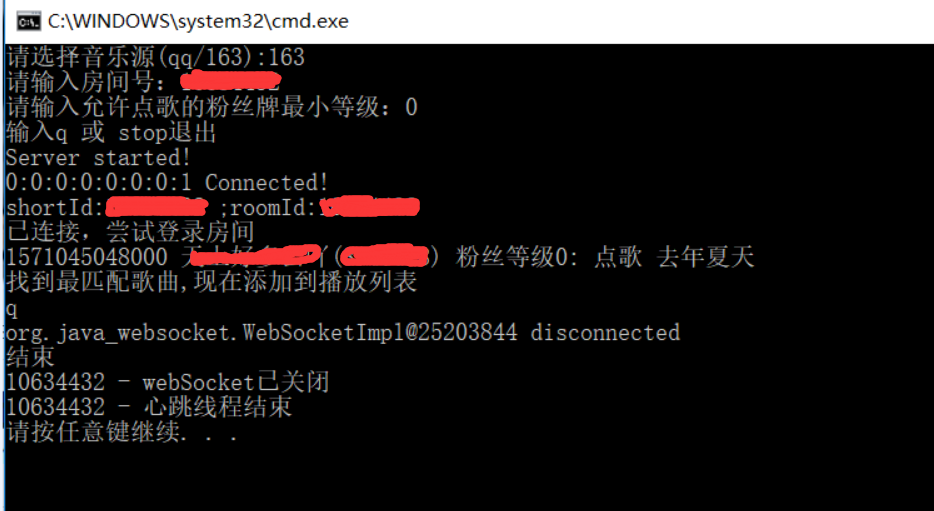
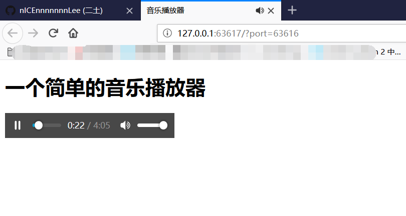

# DanmuMusicPlayer


  


弹幕点歌姬  
===============================  
## :smile:功能  
监听直播间弹幕，当一定等级的粉丝发送`点歌 歌名 singer`时，本地自动搜索并播放歌曲  

+ 直播间弹幕监听支持情况  

| Key  | 是否支持 |
| ------------- | ------------- |  
| bili  | 是 | 
| douyu  | 出了点小问题，施工中 | 

+ 音乐源支持情况  

| Key  | 是否支持 |
| ------------- | ------------- |  
| 网易云音乐  | 是 | 
| QQ音乐  | 是 | 

## :smile:使用方法  
+ Windows下调用`run.bat`即可  
```
set danmukuSource="bili"
set /p musicSource="请选择音乐源(qq/163):"
set /p roomId="请输入房间号："
set /p level="请输入允许点歌的粉丝牌最小等级："

java -Dfile.encoding=utf-8 -jar DanmuFkMusic.jar %danmukuSource% %roomId% %musicSource% %level%
pause
```
+ 预览  

  

## :smile:拓展  
<details>
<summary>关于音乐源</summary>


+ 目前支持网易云和QQ音乐。如有需求，实现接口**nicelee.function.music.source.IMusicAPI**，并在类上加上注释即可。  
举例：
```
@Autoload(source = "音乐源标识", desc = "音乐源描述")  
那么Main方法里，将ws替换为播放器标识即可。如下：  
IMusicAPI api = MusicManager.createMusicAPI("音乐源标识");  
```
</details>

<details>
<summary>关于音乐播放器</summary>


+ 目前只是实现了一个简单的播放器。如有需求，实现接口**nicelee.function.music.player.IMusicPlayer**，并在类上加上注释即可。  
举例：
```
@Autoload(source = "播放器标识", desc = "播放器描述")  
那么Main方法里，将ws替换为播放器标识即可。如下：  
IMusicPlayer player = MusicManager.createMusicPlayer("播放器标识");   
```
</details>  


<details>
<summary>关于更复杂的弹幕逻辑处理</summary>


+ 新增一个**IMsgHandler**并注册即可，返回值代表是否继续处理下一个Handler  
举例：
```
new IMsgHandler() {
    @Override
    public boolean handle(Msg msg, User user) {
        ...
        return true;
    }
} 
```
</details>  

## :smile:其它  
* **下载地址**: [https://github.com/nICEnnnnnnnLee/DanmuMusicPlayer/releases](https://github.com/nICEnnnnnnnLee/DanmuMusicPlayer/releases)
* **GitHub**: [https://github.com/nICEnnnnnnnLee/DanmuMusicPlayer](https://github.com/nICEnnnnnnnLee/DanmuMusicPlayer)  
* **更新历史**: <https://github.com/nICEnnnnnnnLee/DanmuMusicPlayer/blob/master/UPDATE.md>

## :smile:第三方库使用声明  
* 使用[JSON.org](https://github.com/stleary/JSON-java)库做简单的Json解析[](https://github.com/stleary/JSON-java/blob/master/LICENSE)
* 使用[Java-WebSocket](https://github.com/TooTallNate/Java-WebSocket)进行ws连接[](https://github.com/TooTallNate/Java-WebSocket/blob/master/LICENSE)


## :smile:LICENSE 
```
Copyright (C) 2019 NiceLee. All Rights Reserved.

Licensed under the Apache License, Version 2.0 (the "License");
you may not use this file except in compliance with the License.
You may obtain a copy of the License at

    http://www.apache.org/licenses/LICENSE-2.0

Unless required by applicable law or agreed to in writing, software
distributed under the License is distributed on an "AS IS" BASIS,
WITHOUT WARRANTIES OR CONDITIONS OF ANY KIND, either express or implied.
See the License for the specific language governing permissions and
limitations under the License.
```
